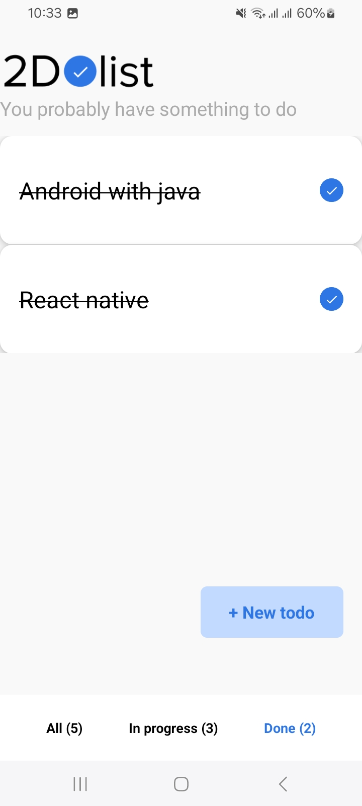
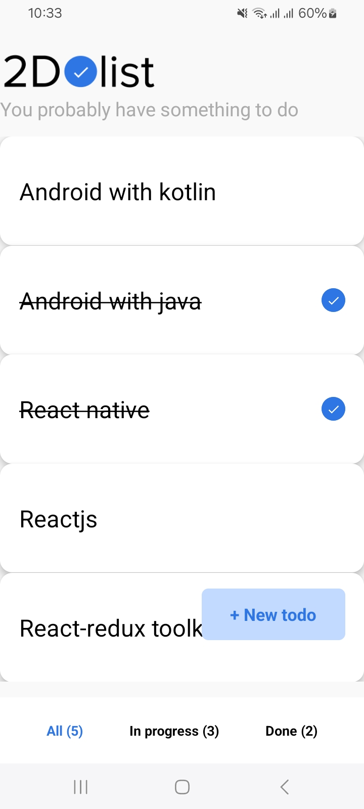
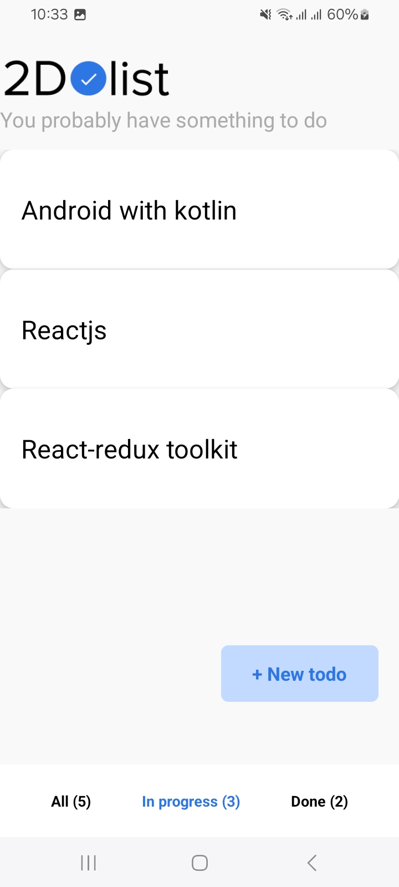

# TodoTaskApp

### For Android

```bash
# using npm
npx expo start

## Project Features

- React Navigation
- React Native Async Storage
- Custom icons from figma
- Redux Toolkit, React Redux

```

## Screens




